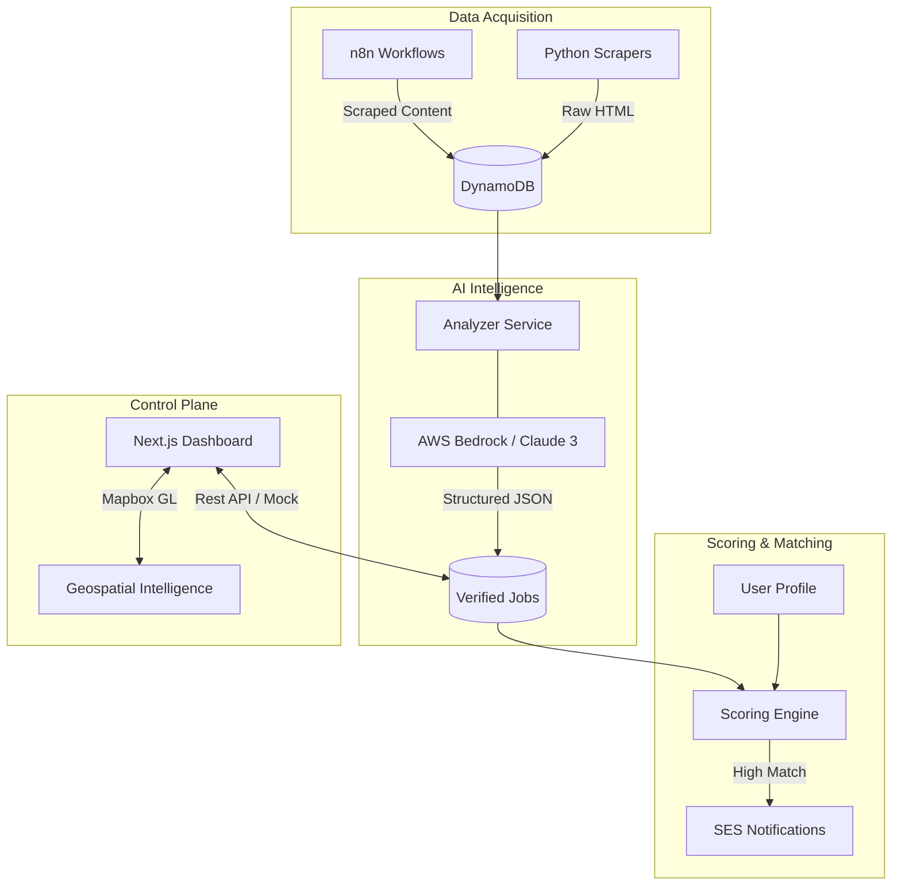

# JobSearch: AI-Powered Career Automation Engine

A high-performance, enterprise-grade AI agent ecosystem designed to automate the entire job search lifecycle. From intelligent scraping and LLM-based analysis to geospatial visualization and automated notifications.

## 🏗️ System Architecture

The ecosystem operates as a distributed, event-driven pipeline:



## 💎 Key Features

- **Geospatial Intelligence Map**: Hardware-accelerated visualization of job markets using Mapbox GL.
- **LLM-Powered Analysis**: Deep extraction of salary ranges, remote policies, and skill requirements from unstructured postings.
- **n8n Orchestration**: Managed workflows for cross-platform scraping and data synchronization.
- **Premium UI/UX**: High-fidelity dashboard with skeleton loading, motion-designed transitions, and unified sidebar management.
- **Enterprise Security**: Least-privilege IAM roles, secure API patterns, and comprehensive input sanitization.

## 🛠️ Tech Stack

### Frontend (Control Plane)
- **Framework**: Next.js 15
- **Styling**: Tailwind CSS
- **Animations**: Framer Motion
- **Visualization**: Mapbox GL JS
- **Icons**: Lucide React

### Backend (Intelligence Layer)
- **Compute**: AWS Lambda (Python 3.11)
- **AI**: AWS Bedrock (Claude 3.5 Sonnet)
- **Database**: DynamoDB (GSIs for high-speed indexing)
- **Orchestration**: n8n (Docker-based)

### Infrastructure (Cloud Native)
- **IaC**: Terraform
- **CI/CD**: Git-based automation
- **Networking**: VPC & Secure API endpoints

## 📂 Project Structure

```bash
JobSearch/
├── frontend/               # Next.js Application (React, Tailwind, Framer Motion)
├── services/               # Modular Lambda services (Analysis, Scoring, Notifications)
├── infrastructure/         # Terraform configurations for AWS
├── n8n/                    # Orchestration workflows and configuration
├── scripts/                # Seeding and maintenance utilities
└── docs/                   # Exhaustive technical documentation
```

## ⚡ Quick Start

### 1. Environment Configuration
Copy the sample environment files and fill in your AWS and Mapbox credentials:
```bash
cp .env.example .env.local
```

### 2. Infrastructure Deployment
Deploy the serverless backend via Terraform:
```bash
cd infrastructure/terraform
terraform init
terraform apply
```

### 3. Frontend Development
Launch the high-fidelity UI:
```bash
cd frontend
pnpm install
pnpm dev
```
Access the dashboard at `http://localhost:3000`.

## 🔒 Security & Performance
- **Zero-Wait UI**: Integrated skeleton loaders for all data-heavy views.
- **Validated Input**: Strict TypeScript interfaces and Zod-based (planned) validation.
- **Performance**: Optimized React render cycles and Mapbox tile caching.

## 📜 License
Distributed under the MIT License. See `LICENSE` for more information.
