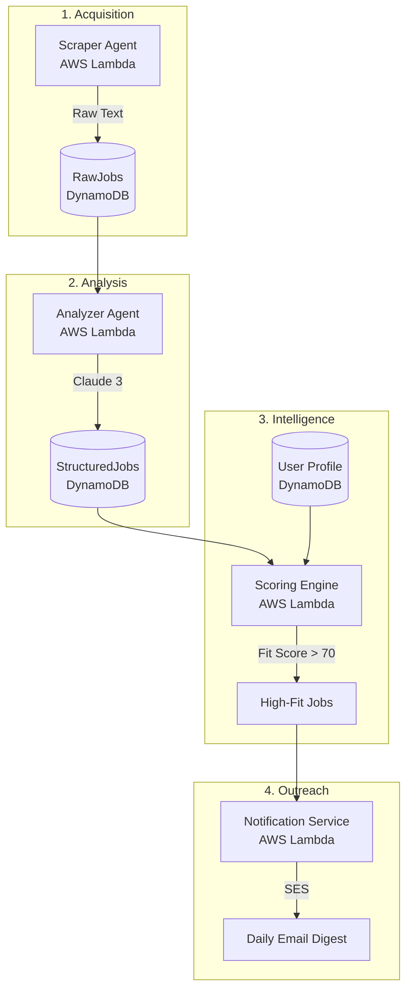

# AI Job Search Automation Agent MVP

A modular, serverless AI agent that automates job discovery, analysis, scoring, and personalized notifications. Built on AWS with Python, Lambda, Bedrock (Claude 3), and Terraform.

## 🏗️ Architecture

The system follows a 4-stage intelligent pipeline:



## 🚀 Features

- **Automated Scraping**: Fetch job postings from multiple sources (simulated MVP).
- **LLM Extraction**: Parse unstructured job descriptions into strict JSON using AWS Bedrock.
- **Personalized Scoring**: Match jobs against your skills, experience, and remote preferences.
- **Daily Digest**: Receive a curated HTML report of top job matches.
- **Infrastructure as Code**: Full AWS deployment via Terraform.

## 🛠️ Tech Stack

- **Compute**: AWS Lambda (Python 3.11)
- **Database**: Amazon DynamoDB
- **AI/LLM**: AWS Bedrock (Claude 3 Sonnet/Haiku)
- **Notifications**: Amazon SES
- **IaC**: Terraform
- **Security**: IAM Least Privilege

## 📦 Project Structure

```bash
ai-job-agent-mvp/
├── infrastructure/terraform/  # Terraform IaC definitions
├── services/                  # Lambda functions
│   ├── scraper/               # Job scraping logic
│   ├── analyzer/              # LLM extraction logic
│   ├── scoring/               # Matching engine
│   └── notifications/         # Email service
├── scripts/                   # Utility scripts (e.g., seeding)
└── requirements.txt           # Python dependencies
```

## ⚡ Deployment

1. **Prerequisites**:
   - AWS CLI configured
   - Terraform installed
   - AWS Bedrock model access enabled (Claude 3)

2. **Initialize & Apply Terraform**:
   ```bash
   cd infrastructure/terraform
   terraform init
   terraform apply
   ```

3. **Seed User Profile**:
   ```bash
   pythonscripts/seed_user.py
   ```

4. **Run the Frontend**:
   ```bash
   cd frontend
   npm install
   npm run dev
   ```
   Open [http://localhost:3000](http://localhost:3000) to view your dashboard.

## 🏁 How the Pipeline Works

1. **Scraper Agent**: Daily fetch (EventBridge) -> Raw Text in DynamoDB.
2. **Analyzer Agent**: Claude 3 Analysis (Bedrock) -> Structured JSON in DynamoDB.
3. **Scoring Engine**: Profile Matching -> Fit Score (0-100).
4. **Notification Service**: If Score > 70 -> Email Digest via SES.
5. **Dashboard**: View high-fit matches and provide feedback (Like/Reject).
